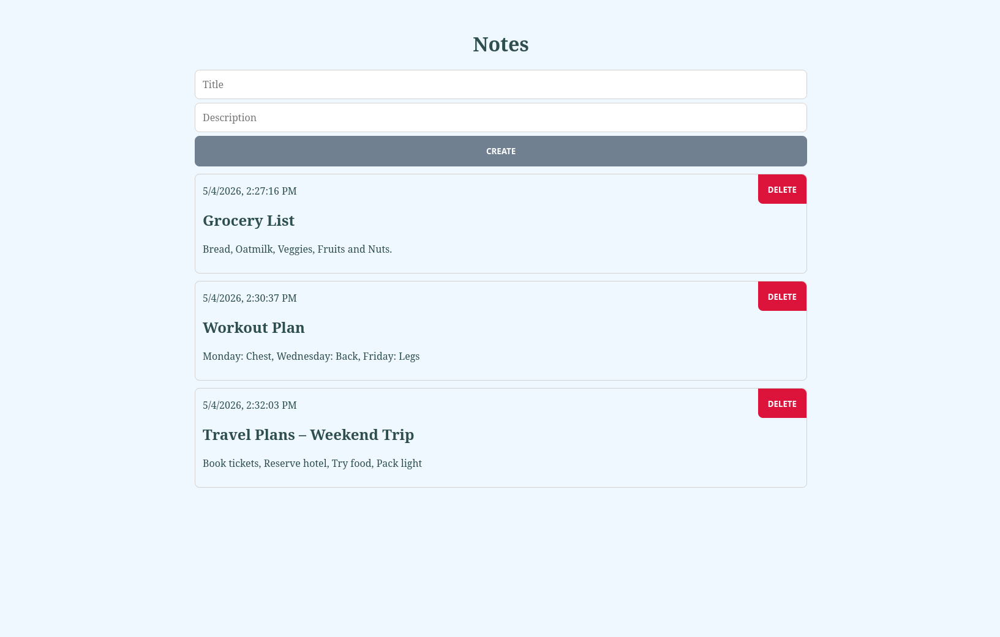

# :notebook: Notes-Frontend

This is a frontend application for managing notes. Made with Vue.js and vite.

## Screenshots


## :computer: Tech-Stack

### Development
- JavaScript
- HTML
- CSS
- vite
- Vue.js

### CI/CD
- GitHub Actions

## :whale: Install with Docker
Make sure the backend setup is done, so this app can access it locally.

Create and start the container:
```bash
docker compose up -d
```

Open the app with the following url: `http://localhost:4100`

## :wheel: Install with Kubernetes
The dedicated backend project already includes this app in the kubernetes settings.
